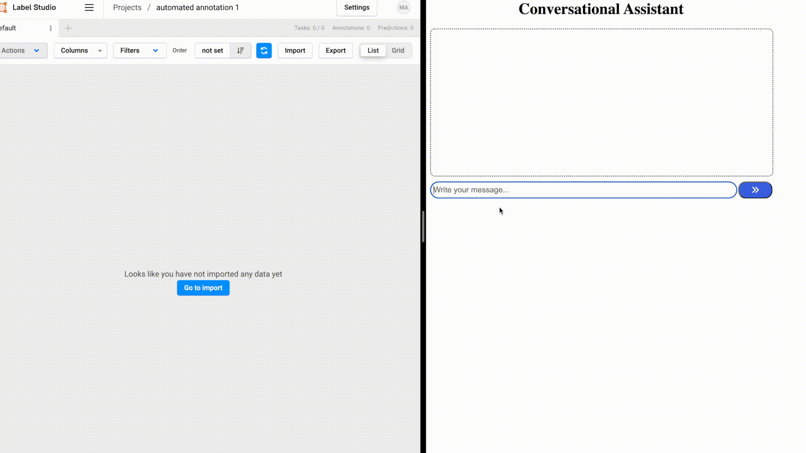
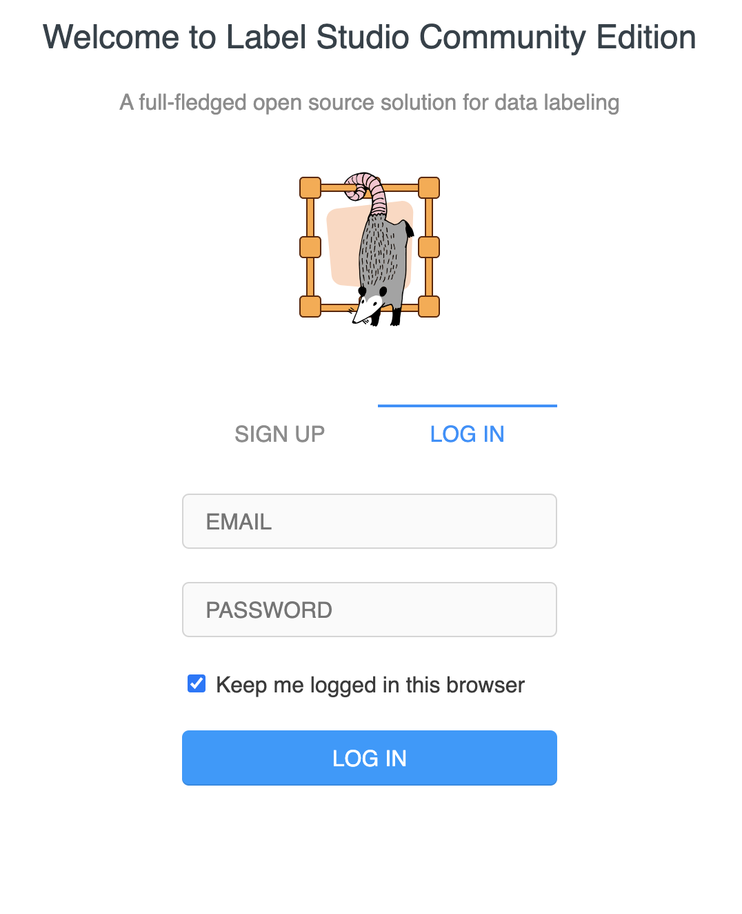
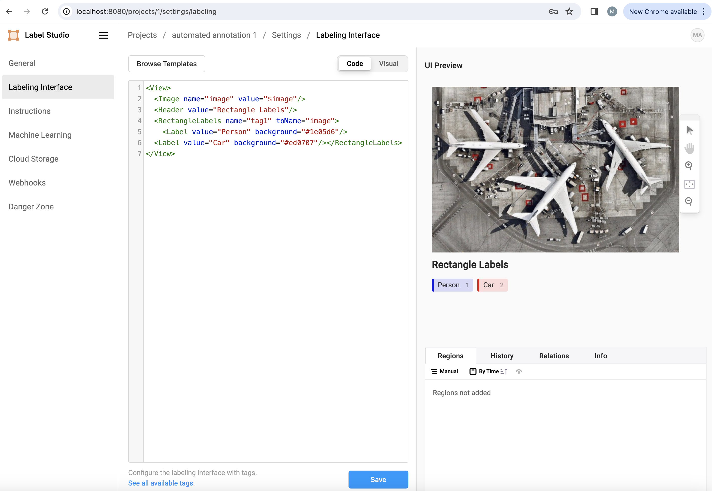
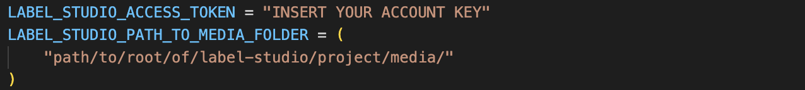

<h1 align="center">Conversational Auto-labeling for Computer Vision Tasks</h1>
<p align="center">

<!--  -->

  
<br>
<a href="https://github.com/matt-quant-heads-io/aimakr-automated-data-annotaton/stargazers"></a>
<a href="https://github.com/abhisheknaiidu/awesome-github-profile-readme/network/members"></a>
<a href="https://github.com/abhisheknaiidu/awesome-github-profile-readme/pulls"></a>
<a href="https://github.com/abhisheknaiidu/awesome-github-profile-readme/issues"></a>
<a href="https://github.com/abhisheknaiidu/awesome-github-profile-readme/graphs/contributors"></a>
<a href="https://github.com/abhisheknaiidu/awesome-github-profile-readme/blob/master/LICENSE"></a>
</p>
<br>
<br>
<p align="center">
  
</p>


### Contents:
- [Sections](#sections)
  - [Install the dependencies via conda](#install-the-dependencies-via-conda)
  - [Install label studio dependencies via conda (in a new terminal)](#install-label-studio-dependencies-via-conda-in-a-new-terminal)
  - [Run Label Studio database migrations](#run-label-studio-database-migrations)
  - [Creating the Label Studio project](#creating-the-label-studio-project)
    - [Create a (free) account](#create-a-free-account)
- [Run the auto-label system](#run-the-auto-label-system)
- [Contribute](#contribute)
- [License](#license)

## Sections

### Install the dependencies via conda
```
git clone https://github.com/matt-quant-heads-io/conversational-auto-labeling.git
conda create -n auto_annotation python=3.10
conda activate auto_annotation
cd aimakr-automated-data-annotaton
python -m pip install -r requirements.txt
```
### Install label studio dependencies via conda (in a new terminal)
```
cd # i.e. from your home dir
git clone https://github.com/HumanSignal/label-studio.git
conda create -n label-studio python=3.10
conda activate label-studio
cd label-studio
python -m pip install -e .
```

### Run Label Studio database migrations
```
python label_studio/manage.py migrate
python label_studio/manage.py collectstatic
python label_studio/manage.py runserver
```

Access http://localhost:8080 from your browser. If the setup went smoothly you should see the following page.

<p align="center">
  
</p>


### Creating the Label Studio project
#### Create a (free) account
Create a project and call it “automated annotation 1”

Access the labelling interface in the project settings and copy and paste the following code snippet:
```
<View>
  <Image name="image" value="$image"/>
  <Header value="Rectangle Labels"/>
  <RectangleLabels name="tag1" toName="image">
    <Label value="Person" background="#1e05d6"/>
    <Label value="Car" background="#ed0707"/>
    <Label value="parking meter" background="#9effec"/>
    <Label value="fire hydrant" background="#d3cc0d"/>
    <Label value="stop sign" background="#FFC069"/>
  </RectangleLabels>
</View>
```

Your page should look like the page below.
<p align="center">
  
</p>

Click the save button.

## Run the auto-label system
Inside of chat_app/constants.py, update the following values specific to your setup. 
<p align="center">
  
</p>

Note: To grab your Access Token, navigate to the account page within the Label Studio UI and copy the token to your clipboard (see page below),
<p align="center">
  
</p>


Access the terminal, cd into aimakr-automated-data-annotation/chat_app and run via:
```
./run
```

After the script is complete you should see the auto-labeled images detailed in the header gif.

## Contribute

Contributions are always welcome!

## License

[](https://creativecommons.org/publicdomain/zero/1.0/)
