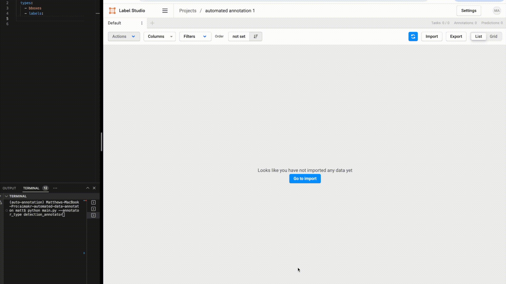

# Automated Label System for Computer Vision Applications

## Install the dependencies via conda
```
git clone https://github.com/matt-quant-heads-io/aimakr-automated-data-annotaton.git
conda create -n auto_annotation python=3.8
conda activate auto_annotation
cd aimakr-automated-data-annotaton
python -m pip install -R requirements.txt
```
## Install label studio dependencies via conda
```
git clone https://github.com/HumanSignal/label-studio.git
conda create --name label-studio
conda activate label-studio
python -m pip install -e .
```

## Run Label Studio database migrations
```
python label_studio/manage.py migrate
python label_studio/manage.py collectstatic
python label_studio/manage.py runserver
```

Access http://localhost:8080 from your browser. If the setup went smoothly you should see the following page.


## Creating the Label Studio project
### Create a (free) account
Create a project and call it “automated annotation 1”
Access the labelling interface in the project settings and copy and paste the following code snippet:
```
<View>
  <Image name="image" value="$image"/>
  <Header value="Rectangle Labels"/>
  <RectangleLabels name="tag1" toName="image">
    <Label value="Person" background="#1e05d6"/>
  <Label value="Car" background="#ed0707"/></RectangleLabels>
</View>
```

Click the save button.

## Run the auto-label system
Inside of constants.py, update the following values specific to your setup. 


Note: To grab your Access Token, navigate to the account page within the Label Studio UI and copy the token to your clipboard (see page below),


Access the terminal within the aimakr-automated-data-annotation repo and run the following command:
```
python main.py --annotator_type detection_annotator
```

After the script is complete you should see the auto-labeled images detailed in the header gif.


